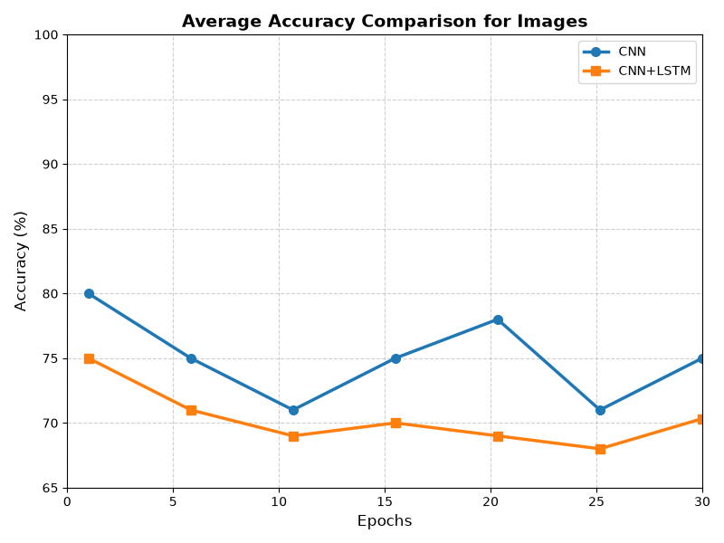
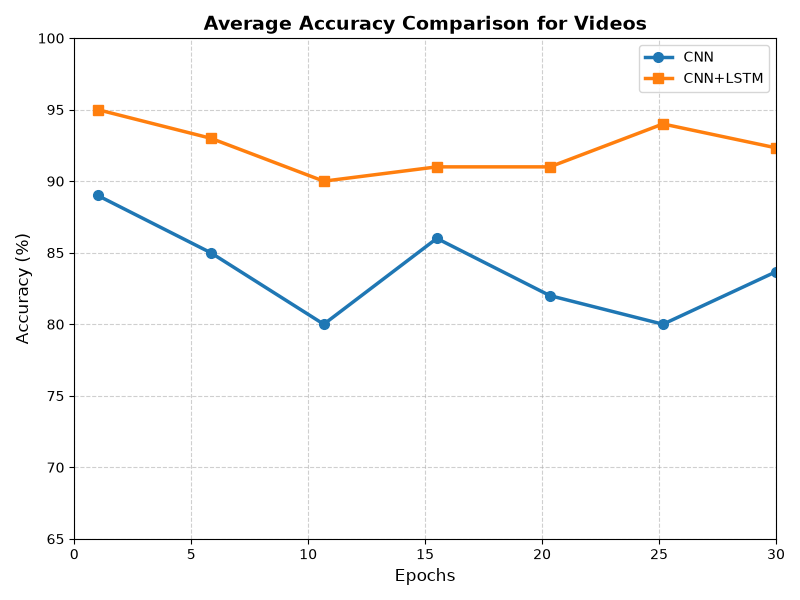

# Facial Emotion Recognition: CNN vs CNN+LSTM

A deep learning project for facial emotion recognition using image and video data, with a comparative study of Convolutional Neural Networks (CNN) and CNN+LSTM architectures.

## Overview

Emotion recognition is an important application of Artificial Intelligence and Computer Vision. Facial expressions contain visual patterns that can be used to identify different emotional states.

This project investigates and compares CNN and CNN+LSTM approaches for emotion recognition from facial images and video sequences.

The CNN component focuses on spatial feature extraction, while the CNN+LSTM architecture combines convolutional feature extraction with LSTM-based temporal learning for sequential data.

The project was developed using Python and deep learning frameworks in a GPU-enabled Google Colab environment.

---

## Objectives

The main objectives of the project are:

- Develop deep learning models for facial emotion recognition.
- Compare CNN and CNN+LSTM approaches.
- Evaluate emotion recognition using image and video data.
- Study spatial feature extraction using convolutional layers.
- Study temporal dependency learning using LSTM layers.
- Evaluate model performance using standard classification metrics.
- Analyze the suitability of different architectures for static and sequential emotion recognition.

---

## CNN vs CNN+LSTM

### CNN

A Convolutional Neural Network is primarily used to learn spatial features from images or individual video frames.

The convolutional layers learn visual patterns such as:

- Edges
- Textures
- Facial structures
- Expression-related features

CNNs are particularly suitable for static image-based emotion recognition.

### CNN+LSTM

The CNN+LSTM architecture combines:

**CNN → Spatial Feature Extraction**

with

**LSTM → Temporal Sequence Learning**

For sequential video data, CNN extracts meaningful visual features from individual frames and LSTM processes the resulting sequence of features to learn temporal relationships between frames.

This makes CNN+LSTM suitable for video-based emotion recognition where emotional expressions may change across consecutive frames.

---

## Methodology

The overall workflow consists of the following stages:

1. Dataset collection
2. Data preprocessing
3. Face/frame processing
4. Feature extraction
5. Sequence generation for video data
6. Model training
7. Model testing
8. Performance evaluation
9. Comparative analysis

### Image Processing

The image-based pipeline includes preprocessing and preparation of facial images before model training.

The processed images are converted into suitable model inputs through operations such as resizing, normalization and transformation.

### Video Processing

The video pipeline extracts individual frames from video sequences.

The extracted frames are processed and organized into sequential groups before being passed through the CNN+LSTM architecture.

The CNN extracts spatial information from individual frames, while the LSTM learns temporal information across the frame sequence.

---

## Model Training

The models were developed and trained using a GPU-enabled Google Colab environment.

The project uses:

- Python
- PyTorch
- Torchvision
- OpenCV
- NumPy
- Matplotlib
- Scikit-learn

The training process uses:

- Cross-Entropy Loss
- Adam Optimizer
- Training and testing datasets
- Classification performance metrics

---

## Evaluation Metrics

The models are evaluated using standard classification metrics:

### Accuracy

Measures the overall proportion of correctly classified samples.

### Precision

Measures how accurately the model identifies samples predicted as a particular emotion.

### Recall

Measures how effectively the model identifies samples belonging to a particular emotion.

### F1-Score

Provides a combined measure of precision and recall.

### Loss

Measures the difference between the predicted output and the actual target during model training.

---

## Datasets

Two publicly available emotion-recognition datasets were used in the project:

### Human Face Emotions Dataset

Used for image-based facial emotion recognition.

### RAVDESS Emotional Speech Video Dataset

Used for video-based emotion recognition and frame-sequence processing.

The actual datasets are not included in this repository.

Dataset sources and usage information are provided in:

`data/README.md`

---

## Results

The repository currently includes accuracy comparison plots for image and video emotion recognition.

### Image Accuracy Comparison



### Video Accuracy Comparison



The project analysis indicates that CNN-based approaches are effective for spatial feature learning, while incorporating LSTM enables temporal learning across sequential video frames.

---

## Repository Structure

```text
facial-emotion-recognition-cnn-vs-cnn-lstm/
│
├── README.md
├── requirements.txt
├── .gitignore
│
├── data/
│   └── README.md
│
├── notebooks/
│   ├── cnn_lstm_image.ipynb
│   └── cnn_lstm_video.ipynb
│
└── results/
    └── figures/
        ├── image_accuracy_comparison.png
        └── video_accuracy_comparison.png
